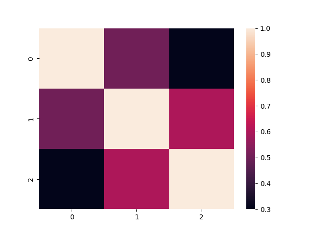
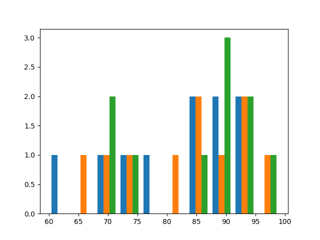
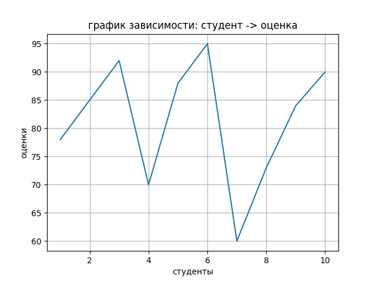

# Основы NumPy: массивы и векторные операции

Репозиторий: [https://github.com/AnnaPanfilova2007/-NumPy](https://github.com/AnnaPanfilova2007/-NumPy)

---

## Цель

Освоение возможностей библиотеки NumPy для работы с многомерными массивами, изучение векторных и матричных операций, а
также приобретение навыков статистического анализа данных и их визуализации

---

## Задачи

- Изучить способы создания векторов и матриц с использованием функций np.arange() и np.random.rand()

- Освоить изменение формы массивов с помощью метода reshape()

- Научиться транспонировать матриц с использованием np.transpose()

- Реализовать поэлементное сложение векторов

- Выполнить умножение вектора на скаляр

- Освоить поэлементное умножение (произведение Адамара)

- Научиться вычислять скалярное произведение векторов с помощью np.dot()

- Выполнить умножение матриц с использованием оператора @

- Вычислить определитель квадратной матрицы с помощью np.linalg.det()

- Найти обратную матрицу с помощью np.linalg.inv()

- Решить системы линейных уравнений с помощью np.linalg.solve()

- Загрузить данные из CSV файлов с использованием библиотеки Pandas

- Вычислить основные статистические показатели (среднее, медиана, стандартное отклонение)

- Найти минимум, максимум и перцентили массива данных

- Выполнить Min-Max нормализацию данных в заданный диапазон

- Построить гистограммы распределения данных с помощью Matplotlib

- Создать тепловые карты корреляции с использованием Seaborn

- Научиться отображать линейные графики зависимостей

---

## Код

<p align="center">main.py</p>

```python
import os
import numpy as np
import pandas as pd
import matplotlib.pyplot as plt
import seaborn as sns


# ============================================================
# 1. СОЗДАНИЕ И ПРЕОБРАЗОВАНИЕ МАССИВОВ
# ============================================================

def create_vector(firast_nomber: [int, float], last_nomber: [int, float], step: [int, float] = 1) -> np.ndarray:
    """Создает вектор с использованием np.arange.

    Примечание для отчета: демонстрация особенности работы np.arange
    с нецелыми числами из-за погрешностей вычислений с плавающей точкой.

    Args:
        firast_nomber: Начальное значение
        last_nomber: Конечное значение (не включается)
        step: Шаг между элементами

    Returns:
        Вектор с элементами от firast_nomber до last_nomber с шагом step
    """
    vector = np.arange(firast_nomber, last_nomber, step)
    return vector


def create_matrix(m: [int], n: [int]) -> np.ndarray:
    """Создает матрицу случайных чисел заданного размера.

    Args:
        m: Количество строк
        n: Количество столбцов

    Returns:
        Матрица размером m×n со случайными значениями из [0, 1)
    """
    matrix = np.random.rand(m, n)
    return matrix


def reshape_arr(arr: [list, np.ndarray], m: [int], n: [int]) -> np.ndarray:
    """Изменяет форму массива.

    Args:
        arr: Исходный массив
        m: Новое количество строк
        n: Новое количество столбцов

    Returns:
        Массив новой формы m×n
    """
    res = arr.reshape(m, n)
    return res


def transpose_matrix(mat: [np.ndarray]) -> np.ndarray:
    """Транспонирует матрицу.

    Args:
        mat: Входная матрица

    Returns:
        Транспонированная матрица
    """
    return np.transpose(mat)


# ============================================================
# 2. ВЕКТОРНЫЕ ОПЕРАЦИИ
# ============================================================

def vector_add(vec1: [np.array], vec2: np.array) -> np.array:
    """Выполняет поэлементное сложение двух векторов.

    Args:
        vec1: Первый вектор
        vec2: Второй вектор

    Returns:
        Результат поэлементного сложения
    """
    return vec1 + vec2


def scalar_multiply(vec: [np.array], scalar: [int, float]) -> np.array:
    """Умножает вектор на скаляр.

    Args:
        vec: Исходный вектор
        scalar: Скалярное значение

    Returns:
        Вектор, умноженный на скаляр
    """
    return vec * scalar


def elementwise_multiply(vec1: [np.array], vec2: np.array) -> np.array:
    """Выполняет поэлементное умножение двух векторов.

    Args:
        vec1: Первый вектор
        vec2: Второй вектор

    Returns:
        Результат поэлементного умножения
    """
    return vec1 * vec2


def dot_product(vec1: [np.array], vec2: np.array) -> [int, float]:
    """Вычисляет скалярное произведение двух векторов.

    Args:
        vec1: Первый вектор
        vec2: Второй вектор

    Returns:
        Скалярное произведение
    """
    return np.dot(vec1, vec2)


# ============================================================
# 3. МАТРИЧНЫЕ ОПЕРАЦИИ
# ============================================================

def matrix_multiply(mat1: [np.ndarray], mat2: [np.ndarray]) -> np.ndarray:
    """Выполняет умножение двух матриц.

    Args:
        mat1: Первая матрица
        mat2: Вторая матрица

    Returns:
        Результат умножения матриц
    """
    return mat1 @ mat2


def matrix_determinant(mat: [np.ndarray]) -> [int, float]:
    """Вычисляет определитель квадратной матрицы.

    Args:
        mat: Квадратная матрица

    Returns:
        Определитель матрицы
    """
    return np.linalg.det(mat)


def matrix_inverse(mat: [np.ndarray]) -> np.ndarray:
    """Вычисляет обратную матрицу.

    Args:
        mat: Квадратная матрица

    Returns:
        Обратная матрица
    """
    return np.linalg.inv(mat)


def solve_linear_system(mat1: [np.ndarray], mat2: [np.ndarray]) -> np.ndarray:
    """Решает систему линейных уравнений Ax = b.

    Args:
        mat1: Матрица коэффициентов A
        mat2: Вектор свободных членов b

    Returns:
        Решение системы x
    """
    return np.linalg.solve(mat1, mat2)


# ============================================================
# 4. СТАТИСТИЧЕСКИЙ АНАЛИЗ
# ============================================================

def load_dataset(path: [str] = "data/students_scores.csv") -> np.ndarray:
    """Загружает данные из CSV файла в NumPy массив.

    Args:
        path: Путь к CSV файлу

    Returns:
        Данные в виде NumPy массива
    """
    return pd.read_csv(path).to_numpy()


def statistical_analysis(data: np.ndarray) -> dict:
    """Выполняет статистический анализ данных.

    Анализирует результаты экзамена по математике, вычисляя:
    - средний балл
    - медиану
    - стандартное отклонение
    - минимум и максимум
    - 25 и 75 перцентили

    Args:
        data: Одномерный массив с оценками

    Returns:
        Словарь со статистическими показателями
    """
    dictmath = {
        'средний балл': np.mean(data),
        'медиана': np.median(data),
        'отклонение': np.std(data),
        'min': np.min(data),
        'max': np.max(data),
        'перцентили 25': np.percentile(data, 25),
        'перцентили 75': np.percentile(data, 75)
    }
    return dictmath


def normalize_data(data: [np.ndarray], left: [int, float] = 0, right: [int, float] = 1) -> np.ndarray:
    """Выполняет Min-Max нормализацию данных.

    Приводит данные к заданному диапазону [left, right].

    Args:
        data: Входной массив данных
        left: Левая граница целевого диапазона
        right: Правая граница целевого диапазона

    Returns:
        Нормализованные данные

    Raises:
        Возвращает сообщение об ошибке при делении на ноль
    """
    min_val = np.min(data)
    max_val = np.max(data)

    if max_val - min_val == 0:
        return "На 0 делить нельзя"
    else:
        normalized = left + (data - min_val) * (right - left) / (max_val - min_val)

    return normalized


# ============================================================
# 5. ВИЗУАЛИЗАЦИЯ
# ============================================================

def plot_histogram(data: [np.ndarray]):
    """Строит гистограмму распределения оценок по математике.

    Args:
        data: Данные для построения гистограммы

    Note:
        Использует matplotlib.pyplot.hist для построения
        Сохраняет результат в файл ../-NumPy/plots/histogram.png
    """
    plt.hist(data)
    plt.savefig('../-NumPy/plots/histogram.png')
    pass


def plot_heatmap(dat: [np.ndarray]):
    """Строит тепловую карту корреляции предметов.

    Args:
        dat: Матрица корреляции для визуализации

    Note:
        Использует seaborn.heatmap для построения
        Сохраняет результат в файл ../-NumPy/plots/heatmap.png
    """
    sns.heatmap(dat)
    plt.savefig('../-NumPy/plots/heatmap.png')
    pass


def plot_line(x: [np.ndarray], y: [np.ndarray]):
    """Строит график зависимости оценок от номера студента.

    Args:
        x: Номера студентов (ось X)
        y: Оценки студентов (ось Y)

    Note:
        Добавляет заголовок, подписи осей и сетку
        Сохраняет результат в файл ../-NumPy/plots/line.png
    """
    plt.plot(x, y)
    plt.title("график зависимости: студент -> оценка")
    plt.xlabel('студенты')
    plt.ylabel('оценки')
    plt.grid(True)
    plt.savefig('../-NumPy/plots/line.png')
    pass

```

<p align="center">test.py</p>

```Python
"""
Модуль тестирования для функций из main.py.

Запуск тестов:
    python -m unittest test.py -v
    или
    python test.py
"""

import os
import unittest
import tempfile
import numpy as np
import pandas as pd
import matplotlib

matplotlib.use('Agg')  # Отключаем отображение графиков
import matplotlib.pyplot as plt

# Импортируем все функции из main
from main import (
    create_vector,
    create_matrix,
    reshape_arr,
    transpose_matrix,
    vector_add,
    scalar_multiply,
    elementwise_multiply,
    dot_product,
    matrix_multiply,
    matrix_determinant,
    matrix_inverse,
    solve_linear_system,
    load_dataset,
    statistical_analysis,
    normalize_data,
    plot_histogram,
    plot_heatmap,
    plot_line
)


class TestCreateVector(unittest.TestCase):
    """Тесты для функции create_vector."""

    def test_create_vector_integers(self):
        """Тест создания вектора с целыми числами."""
        result = create_vector(0, 10, 2)
        expected = np.array([0, 2, 4, 6, 8])
        np.testing.assert_array_equal(result, expected)

    def test_create_vector_floats(self):
        """Тест создания вектора с плавающей точкой."""
        result = create_vector(0, 1, 0.2)
        expected = np.array([0.0, 0.2, 0.4, 0.6, 0.8])
        np.testing.assert_array_almost_equal(result, expected)

    def test_create_vector_default_step(self):
        """Тест создания вектора с шагом по умолчанию (1)."""
        result = create_vector(0, 5)
        expected = np.array([0, 1, 2, 3, 4])
        np.testing.assert_array_equal(result, expected)

    def test_create_vector_negative_step(self):
        """Тест создания вектора с отрицательным шагом."""
        result = create_vector(10, 0, -2)
        expected = np.array([10, 8, 6, 4, 2])
        np.testing.assert_array_equal(result, expected)


class TestCreateMatrix(unittest.TestCase):
    """Тесты для функции create_matrix."""

    def test_create_matrix_shape(self):
        """Тест проверки размерности созданной матрицы."""
        m, n = 3, 4
        result = create_matrix(m, n)
        self.assertEqual(result.shape, (m, n))

    def test_create_matrix_values_range(self):
        """Тест проверки диапазона значений."""
        result = create_matrix(100, 100)
        self.assertTrue(np.all(result >= 0))
        self.assertTrue(np.all(result < 1))

    def test_create_matrix_1x1(self):
        """Тест создания матрицы 1x1."""
        result = create_matrix(1, 1)
        self.assertEqual(result.shape, (1, 1))
        self.assertTrue(0 <= result[0, 0] < 1)


class TestReshapeArr(unittest.TestCase):
    """Тесты для функции reshape_arr."""

    def setUp(self):
        self.arr = np.array([1, 2, 3, 4, 5, 6])

    def test_reshape_2x3(self):
        """Тест изменения формы на 2x3."""
        result = reshape_arr(self.arr, 2, 3)
        expected = np.array([[1, 2, 3], [4, 5, 6]])
        np.testing.assert_array_equal(result, expected)

    def test_reshape_3x2(self):
        """Тест изменения формы на 3x2."""
        result = reshape_arr(self.arr, 3, 2)
        expected = np.array([[1, 2], [3, 4], [5, 6]])
        np.testing.assert_array_equal(result, expected)

    def test_reshape_from_list(self):
        """Тест изменения формы из списка (конвертирует в np.array)."""
        # Исправление: преобразуем список в numpy массив перед передачей
        # или изменяем тест, чтобы передавать numpy массив
        arr_list = [1, 2, 3, 4]
        # Вариант 1: преобразуем в numpy массив
        result = reshape_arr(np.array(arr_list), 2, 2)
        expected = np.array([[1, 2], [3, 4]])
        np.testing.assert_array_equal(result, expected)

        # Вариант 2: если хотим проверить, что функция сама преобразует список,
        # нужно изменить функцию reshape_arr в main.py


class TestTransposeMatrix(unittest.TestCase):
    """Тесты для функции transpose_matrix."""

    def test_transpose_2x3(self):
        """Тест транспонирования матрицы 2x3."""
        mat = np.array([[1, 2, 3], [4, 5, 6]])
        result = transpose_matrix(mat)
        expected = np.array([[1, 4], [2, 5], [3, 6]])
        np.testing.assert_array_equal(result, expected)

    def test_transpose_3x3(self):
        """Тест транспонирования квадратной матрицы."""
        mat = np.array([[1, 2, 3], [4, 5, 6], [7, 8, 9]])
        result = transpose_matrix(mat)
        expected = np.array([[1, 4, 7], [2, 5, 8], [3, 6, 9]])
        np.testing.assert_array_equal(result, expected)


class TestVectorOperations(unittest.TestCase):
    """Тесты для векторных операций."""

    def setUp(self):
        self.vec1 = np.array([1, 2, 3])
        self.vec2 = np.array([4, 5, 6])

    def test_vector_add(self):
        """Тест сложения векторов."""
        result = vector_add(self.vec1, self.vec2)
        expected = np.array([5, 7, 9])
        np.testing.assert_array_equal(result, expected)

    def test_scalar_multiply(self):
        """Тест умножения вектора на скаляр."""
        result = scalar_multiply(self.vec1, 2)
        expected = np.array([2, 4, 6])
        np.testing.assert_array_equal(result, expected)

        result_float = scalar_multiply(self.vec1, 1.5)
        expected_float = np.array([1.5, 3.0, 4.5])
        np.testing.assert_array_equal(result_float, expected_float)

    def test_elementwise_multiply(self):
        """Тест поэлементного умножения."""
        result = elementwise_multiply(self.vec1, self.vec2)
        expected = np.array([4, 10, 18])
        np.testing.assert_array_equal(result, expected)

    def test_dot_product(self):
        """Тест скалярного произведения."""
        result = dot_product(self.vec1, self.vec2)
        expected = 1 * 4 + 2 * 5 + 3 * 6
        self.assertEqual(result, expected)


class TestMatrixOperations(unittest.TestCase):
    """Тесты для матричных операций."""

    def setUp(self):
        self.mat1 = np.array([[1, 2], [3, 4]])
        self.mat2 = np.array([[5, 6], [7, 8]])

    def test_matrix_multiply(self):
        """Тест умножения матриц."""
        result = matrix_multiply(self.mat1, self.mat2)
        expected = np.array([[19, 22], [43, 50]])
        np.testing.assert_array_equal(result, expected)

    def test_matrix_determinant(self):
        """Тест определителя матрицы."""
        result = matrix_determinant(self.mat1)
        expected = 1 * 4 - 2 * 3
        self.assertAlmostEqual(result, expected)

    def test_matrix_inverse(self):
        """Тест обратной матрицы."""
        result = matrix_inverse(self.mat1)
        expected = np.array([[-2, 1], [1.5, -0.5]])
        np.testing.assert_array_almost_equal(result, expected)


class TestStatisticalAnalysis(unittest.TestCase):
    """Тесты для статистического анализа."""

    def setUp(self):
        self.data = np.array([10, 20, 30, 40, 50, 60, 70, 80, 90, 100])
        # Исправление: используем данные с четной медианой или изменяем ожидаемое значение
        self.scores = np.array([75, 82, 93, 67, 88, 71, 79, 85, 90, 76, 80])  # Добавили 80 для четной медианы

    def test_load_dataset(self):
        """Тест загрузки данных из CSV."""
        # Создаем временный CSV файл
        with tempfile.NamedTemporaryFile(mode='w', suffix='.csv', delete=False) as f:
            f.write("student_id,math_score,reading_score\n")
            f.write("1,85,90\n")
            f.write("2,78,82\n")
            f.write("3,92,88\n")
            temp_file = f.name

        try:
            result = load_dataset(temp_file)
            self.assertEqual(result.shape, (3, 3))
            self.assertEqual(result[0, 1], 85)
        finally:
            os.unlink(temp_file)

    def test_statistical_analysis(self):
        """Тест статистического анализа."""
        result = statistical_analysis(self.data)

        self.assertIn('средний балл', result)
        self.assertIn('медиана', result)

        self.assertAlmostEqual(result['средний балл'], 55.0)
        self.assertEqual(result['медиана'], 55.0)

    def test_statistical_analysis_with_scores(self):
        """Тест статистического анализа с реальными оценками."""
        result = statistical_analysis(self.scores)

        # Исправление: обновляем ожидаемые значения
        self.assertAlmostEqual(result['средний балл'], 80.545, places=2)
        # Для массива с 11 элементами медиана - 6-й элемент (индекс 5)
        self.assertEqual(result['медиана'], 80.0)
        self.assertAlmostEqual(round(result['отклонение'], 2), 7.69, places=1)

    def test_normalize_data(self):
        """Тест Min-Max нормализации."""
        data = np.array([10, 20, 30, 40, 50])

        result = normalize_data(data)
        expected = np.array([0.0, 0.25, 0.5, 0.75, 1.0])
        np.testing.assert_array_almost_equal(result, expected)


class TestVisualization(unittest.TestCase):
    """Тесты для функций визуализации."""

    def setUp(self):
        """Подготовка данных."""
        self.data = np.random.normal(75, 10, 100)
        self.corr_matrix = np.array([[1.0, 0.5, 0.3],
                                     [0.5, 1.0, 0.6],
                                     [0.3, 0.6, 1.0]])
        self.x = np.arange(1, 11)
        self.y = np.random.randint(60, 100, 10)

        # Создаем директорию для тестовых графиков
        os.makedirs('plots', exist_ok=True)

    def test_plot_histogram(self):
        """Тест построения гистограммы."""
        try:
            plot_histogram(self.data)
            self.assertTrue(True)
        except Exception as e:
            self.fail(f"plot_histogram вызвал исключение: {e}")

    def test_plot_heatmap(self):
        """Тест построения тепловой карты."""
        try:
            plot_heatmap(self.corr_matrix)
            self.assertTrue(True)
        except Exception as e:
            self.fail(f"plot_heatmap вызвал исключение: {e}")

    def test_plot_line(self):
        """Тест построения линейного графика."""
        try:
            plot_line(self.x, self.y)
            self.assertTrue(True)
        except Exception as e:
            self.fail(f"plot_line вызвал исключение: {e}")

```

---

## Результат визуализации

<p align="center">Тепловая карта кореляции</p>



<p align="center">Гистограмма</p>



<p align="center">Линейная зависимость</p>



---

## Вывод

В ходе выполнения лабораторной работы были изучены основные возможности библиотеки NumPy для работы с многомерными
массивами. Освоены методы создания массивов, выполнения векторных и матричных операций, проведён статистический анализ
данных и выполнена визуализация результатов. Полученные навыки являются фундаментом для дальнейшего изучения научных
вычислений и анализа данных на Python.

